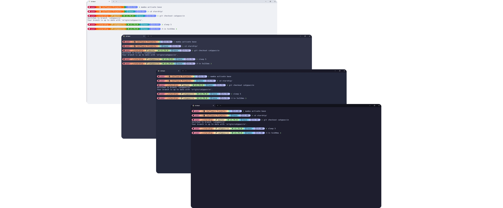

<h3 align="center">
	<br/>
	
	Catppuccin for <a href="https://starship.rs">Starship</a>
	
</h3>

<p align="center">
	<a href="https://github.com/catppuccin/starship/stargazers"></a>
	<a href="https://github.com/catppuccin/starship/issues"></a>
	<a href="https://github.com/catppuccin/starship/contributors"></a>
</p>

<p align="center">
	
</p>

## Usage

1. Copy your desired palette(s) from `palettes` 🗂️
   - 🌻 [Latte](palettes/latte.toml)
   - 🪴 [Frappé](palettes/frappe.toml)
   - 🌺 [Macchiato](palettes/macchiato.toml)
   - 🌿 [Mocha](palettes/mocha.toml)
2. Find (or create) your `starship.toml` to paste into
   - Typically at `~/.config/starship.toml`
3. Paste your palette(s)
   - Note that palette tables should be grouped together at the bottom of your config
4. Set your `palette = "catppuccin_flavor"` value, save and quit!

Check out this [example starship.toml](starship.toml) for how to define and use custom palettes

### With [Home Manager](https://github.com/nix-community/home-manager)

1. Add this snippet to your home-manager configuration

```nix
{ pkgs, ... }: {
  programs.starship =
    let
      flavour = ""; # One of `latte`, `frappe`, `macchiato`, or `mocha`
    in
    {
      enable = true;
      settings = {
        # Other config here
        format = "$all"; # Remove this line to disable the default prompt format
        palette = "catppuccin_${flavour}";
      } // builtins.fromTOML (builtins.readFile
        (pkgs.fetchFromGitHub
          {
            owner = "catppuccin";
            repo = "starship";
            rev = ""; # Replace with the latest commit hash
            sha256 = "";
          } + /palettes/${flavour}.toml));
    };
}
```

2. Rebuild your configuration. There should be an error about the invalid checksum
3. Paste the sha256 checksum from the error message into the `sha256` field
4. Rebuild again

## 💝 Thanks to

- [bexli](https://github.com/joshpaulie)
- [Stonks3141](https://github.com/Stonks3141)

&nbsp;

<p align="center">
	
</p>

<p align="center">
	Copyright &copy; 2021-present <a href="https://github.com/catppuccin" target="_blank">Catppuccin Org</a>
</p>

<p align="center">
	<a href="https://github.com/catppuccin/catppuccin/blob/main/LICENSE"></a>
</p>
